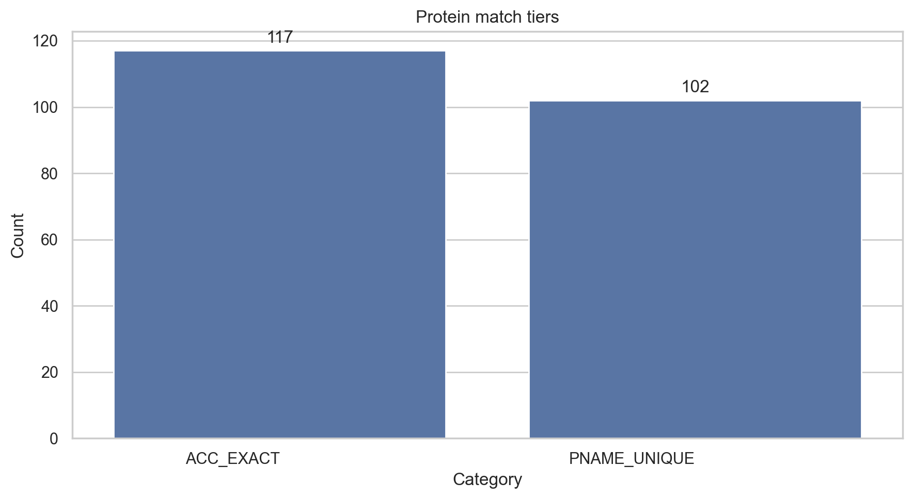
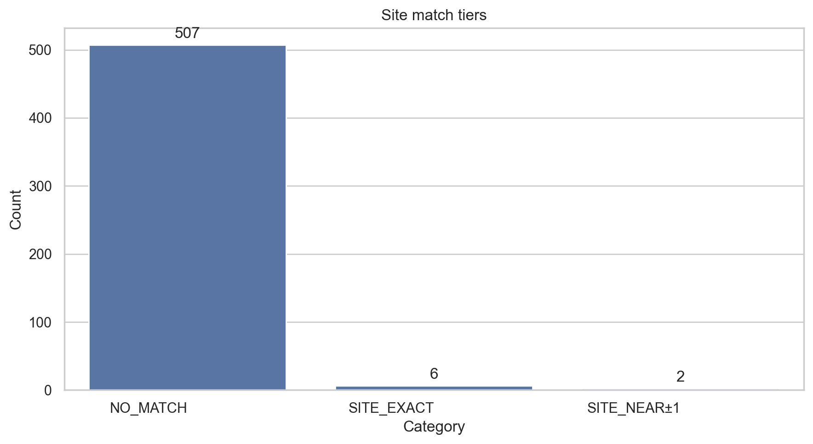

# O-GlcNAc Matcher Quick Report

## Counters
| Item | Rows |
|---|---|
| Proteins overlap | 219 |
| HexNAc sites | 515 |

## Category Bars
- **Protein match tiers**  

- **Site match tiers**  

## Venn Diagrams
No Venn diagrams available.

## Warnings
- Venn 'ODB vs Experimental Proteins' skipped: no data for set 'ODB' (data/processed/matches/homo-sapiens.csv).
