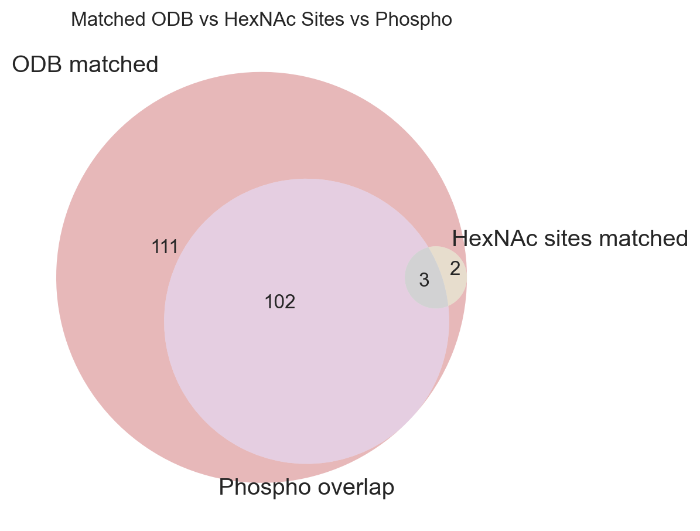

# O-GlcNAc Matcher Test Report

## Counters
| Item | Rows |
|---|---|
| Proteins overlap | 219 |
| HexNAc sites | 515 |

## Category Bars
- **Protein match tiers**  

- **Site match tiers**  

## Venn Diagrams
- **Matched ODB vs HexNAc Sites vs Phospho**  

